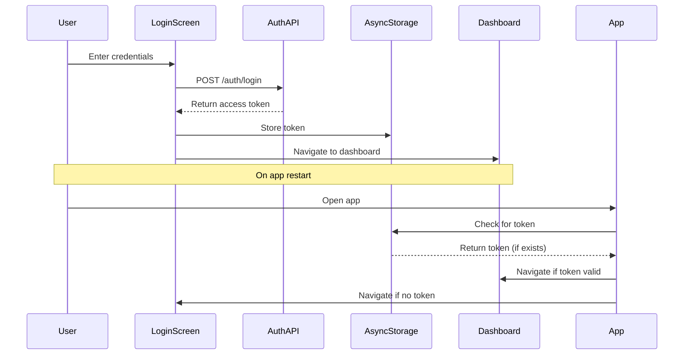

# Design Document

## Overview

The mobile authentication system implements a secure login flow using token-based authentication. The system consists of a login screen with form validation, secure token storage using AsyncStorage, authentication state management, and route protection for the dashboard. The design leverages the existing shared API infrastructure and follows React Native best practices.

## Architecture

### Authentication Flow



### Component Architecture

- **AuthProvider**: Context provider for authentication state
- **LoginScreen**: Form-based login interface
- **ProtectedRoute**: Higher-order component for route protection
- **AuthStorage**: Utility for secure token management

## Components and Interfaces

### AuthProvider Context

```typescript
interface AuthContextType {
  isAuthenticated: boolean;
  token: string | null;
  login: (credentials: LoginRequest) => Promise<void>;
  logout: () => Promise<void>;
  loading: boolean;
  error: string | null;
}
```

### LoginScreen Component

- Uses existing Input and Button base components
- Implements form validation for username/password
- Handles loading states during authentication
- Displays error messages for failed login attempts
- Redirects to dashboard on successful authentication

### AuthStorage Utility

```typescript
interface AuthStorage {
  getToken(): Promise<string | null>;
  setToken(token: string): Promise<void>;
  removeToken(): Promise<void>;
}
```

### Route Protection

- Implements authentication check in root layout
- Redirects unauthenticated users to login
- Preserves intended navigation destination
- Handles token validation and cleanup

## Data Models

### Authentication State

```typescript
interface AuthState {
  isAuthenticated: boolean;
  token: string | null;
  loading: boolean;
  error: string | null;
}
```

### Login Form State

```typescript
interface LoginFormState {
  username: string;
  password: string;
  errors: {
    username?: string;
    password?: string;
    general?: string;
  };
  isSubmitting: boolean;
}
```

## Error Handling

### Authentication Errors

- **Invalid Credentials**: Display user-friendly error message
- **Network Errors**: Show retry option with appropriate messaging
- **Token Expiration**: Automatically redirect to login and clear stored token
- **Validation Errors**: Real-time form validation with field-specific messages

### Error Recovery

- Automatic token cleanup on authentication failures
- Graceful fallback to login screen for any auth-related errors
- Retry mechanisms for network-related failures
- Clear error states on successful operations

## Testing Strategy

### Unit Tests

- AuthProvider context functionality
- AuthStorage utility methods
- Form validation logic
- Error handling scenarios

### Integration Tests

- Login flow end-to-end
- Token storage and retrieval
- Route protection behavior
- Authentication state persistence

### Component Tests

- LoginScreen form interactions
- Button and input component integration
- Loading and error state rendering
- Navigation behavior on success/failure

## Security Considerations

### Token Storage

- Use AsyncStorage for token persistence
- Implement token validation before API calls
- Clear tokens on logout or authentication errors
- Consider token expiration handling

### Form Security

- Secure text entry for password field
- Input sanitization and validation
- Protection against common injection attacks
- Rate limiting considerations for login attempts

## Implementation Notes

### Existing Infrastructure Usage

- Leverage existing `useLoginMutation` hook from shared API
- Utilize existing Button and Input base components
- Follow established styling patterns and color schemes
- Integrate with existing Expo Router navigation structure

### State Management

- Use React Context for authentication state
- Implement loading states for better UX
- Handle form state with controlled components
- Persist authentication state across app restarts

### Navigation Integration

- Modify root layout to check authentication status
- Implement protected route wrapper
- Handle deep linking with authentication checks
- Provide smooth transitions between screens
